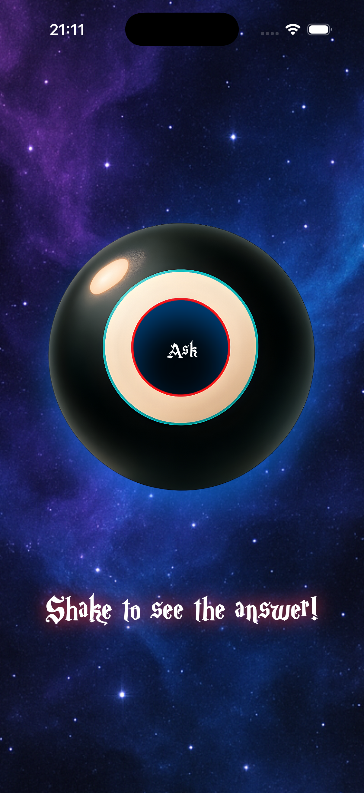
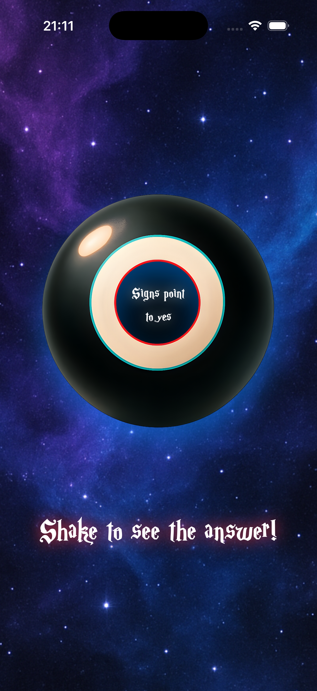
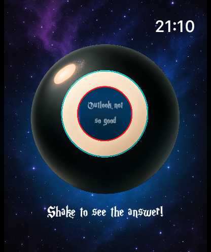

// Magic 8 Ball — iPhone + Apple Watch

A delightful, modern SwiftUI take on the classic Magic 8 Ball. Ask a question, shake your device (or tap), and get a whimsical, animated answer. Includes a beautifully integrated Apple Watch companion for quick, on-the-go fortune checks.

- Platforms: iOS + watchOS
- Tech: SwiftUI, Swift Concurrency, Haptics, Watch Connectivity (if applicable)
- Status: Production-ready sample app

## Contents
- Overview
- Features
- Screenshots
- How It Works
- Architecture & Tech
- Requirements
- Installation
- Privacy & Data
- Testing
- Roadmap
- Contributing
- License

## Overview
Magic 8 Ball brings a playful experience to your Apple devices with smooth animations, subtle haptics, and a clean interface. The app embraces platform conventions so it feels right at home on iPhone and Apple Watch.

- Ask anything. Shake or tap to get an answer.
- Crisp animations and delightful haptics amplify the moment.
- Apple Watch app for ultra-fast, glanceable results.

## Features
- Fast, fluid interactions (shake or tap)
- Curated set of classic 8-ball responses
- Optional haptics feedback for realism
- Lightweight, responsive SwiftUI UI
- Apple Watch companion for quick checks
- Accessibility-friendly (Dynamic Type, VoiceOver labels where applicable)

## Screenshots
Replace the image paths below with your actual screenshot file names once added to the repository. A common convention is to store images under an `Assets` or `Screenshots` folder.

- iPhone — Home

- iPhone — Answer

- Apple Watch — Home

- Apple Watch — Answer

Tip: If you prefer reference-style links, you can define them at the bottom of this file.

## How It Works
1. User asks a question (silently or aloud — we don’t record anything).
2. A shake gesture or a tap triggers the answer generation.
3. The app picks a response from a curated list and animates it into view.
4. Subtle haptics and sound (if enabled) add tactile feedback.
5. On Apple Watch, a single tap provides an instant answer with a glanceable layout.

## Architecture & Tech
- SwiftUI for UI on iOS and watchOS
- State-driven design using `@State` and/or `@Observable` types
- Swift Concurrency for any async tasks or delays (if present)
- Haptics for tactile feedback on shake/tap
- Watch app implemented as a companion target

If the project includes shared code between iOS and watchOS, common logic lives in a shared module to minimize duplication.

## Requirements
- Xcode 15 or later
- iOS 17 or later (adjust if your project supports earlier versions)
- watchOS 10 or later (adjust as needed)

## Installation
- Clone the repository
- Open the `.xcodeproj` or `.xcworkspace` in Xcode
- Select the iOS scheme and run on a simulator or device
- For Apple Watch, select the watch scheme or run the watch app via the paired simulator/device

## Privacy & Data
- No personal data collection
- No network calls required for answers
- All logic runs on-device

## Testing
- Unit tests (if included) cover the response generator and state transitions
- UI previews via SwiftUI `#Preview` macros
- To add tests: create a new test target and add cases for the response list and triggering logic

## Roadmap
- Localized responses
- Configurable response sets
- Optional sound effects
- Live Activity or widget support

## Contributing
Contributions are welcome! Please:
- Open an issue describing your proposal or bug
- Keep pull requests focused and small
- Follow Swift API design guidelines and platform conventions

## License
This project is available under the MIT License. See `LICENSE` for details.

---

### Notes for Maintainers
- Keep screenshots up to date for both iPhone and Apple Watch
- Validate accessibility with VoiceOver and larger text sizes
- Verify haptics behavior on physical devices
